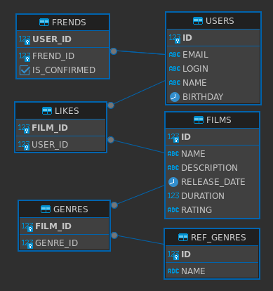

# Java-filmorate
## Модель данных
1. **Таблица USERS**. ID - первичный ключ, автогенерируемый. Содержит сведения о пользователях. 
2. **Таблица FRIENDS**. Данные о дружбе. Таблица содержит связи пользователей  из таблицы USERS. USER_ID и FRIEND_ID - внешние ключи 
3. **Таблиц FILMS**. Данные о фильмах, MPA - первичный ключ, на справочник REF_MPA
4. **Таблица LIKES**. Лайки пользователей для фильмов. Содержит связи FILM_ID, USER_ID - внешние ключи.
5. **Таблица GENRES**. Т.к. фильм может относится к нескольким жанрам, жанры к конкретному фильму вынесены в отдельную таблицу, которая связана с фильмом по внешнему ключю и с жанром.
6. **Таблица REF_GENRES**. Справочник жанров.
7. **Таблица REF_MPA**. Справочник MPA.

